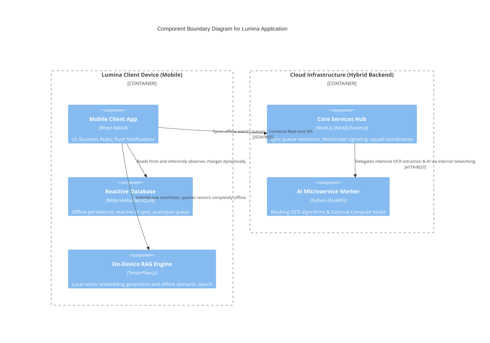

# Application Components

This document outlines the core structural components of the Lumina Monorepo architecture based on the selected hybrid backend structure.

## 1. Lumina Mobile Client (Frontend Engine)
- **Purpose**: The primary offline-first UX serving engineering students.
- **Responsibilities**: Renders UI via React Native, coordinates local vector retrieval for RAG, tracks user screen interactions for ContextSwitch algorithm, handles local data ingress and egress.
- **Interfaces**: Connects natively to WatermelonDB APIs, initiates WebSocket connections to Core Node.js Hub, and executes REST actions.

## 2. Core Node.js Hub (Services Gateway)
- **Purpose**: The central nervous system for online synchronization and multi-user chat routing across squads.
- **Responsibilities**: WebSocket state management, handling offline queue sync payloads from WatermelonDB clients, orchestrating shared Kanban persistence, exposing REST interface bridges to Python AI instances.
- **Interfaces**: Internal REST API Controllers, WebSocket (Socket.io) Server, Database Context Adapter (TypeORM/Prisma via PostgreSQL).

## 3. Python AI Microservice (Worker Layer)
- **Purpose**: Handles heavy algorithmic workflows and strict computer vision / AI inference capabilities decoupled from the Node.js event loop.
- **Responsibilities**: OCR extraction of timetables from PDFs/images, mathematical analytics for Cognitive Debt mapping if processing exceeds client limits.
- **Interfaces**: REST APIs over internal cloud networking exclusively triggered by the Node.js Node Gateway.

## 4. On-Device RAG Engine (Local NLP Module)
- **Purpose**: Offline Natural Language Processing ensuring total data privacy.
- **Responsibilities**: Generating high-dimension vector embeddings within the React Native client runtime boundaries (via TensorFlow.js or similar embedded model), securely storing generated vectors locally alongside WatermelonDB data.
- **Interfaces**: Local context querying APIs triggered purely by the Mobile Client UX without network transmission.

## Component Architecture Layout

