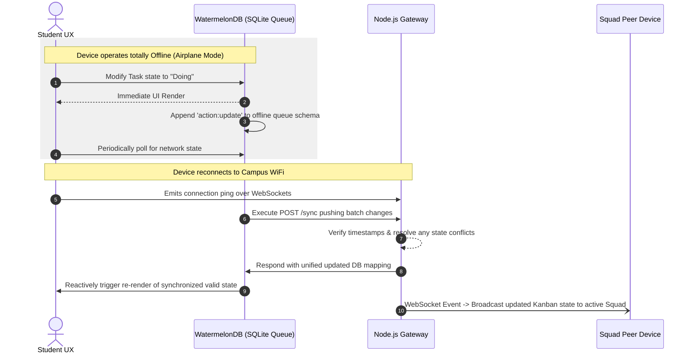

# Service Layer Orchestration

## 1. Offline Sync Orchestrator
- **Definition**: Handles precise push/pull conflict operations originating from the local WatermelonDB instance to the central Node.js backend.
- **Responsibilities**: 
  - Retrieves local SQLite queues formatting them to batch generic REST arrays for payload delivery.
  - Ensures atomic actions performed offline (such as Kanban drops, Attendance marking ticks) seamlessly replace their temporary client IDs with permanent server-issued UUIDs natively.
  - Mitigates collision if two students modify the squad Kanban simultaneously.

## 2. Squad Real-Time Service
- **Definition**: WebSocket event publisher module housed in Node.js.
- **Responsibilities**: 
  - Subscribes active online users to persistent channels matching their `squadId`.
  - Pushes Focus Graph vector updates and Group Chat messages exclusively to joined logical squad rooms instantly.

## 3. Cognitive Behavioral Service (Native/Local Context)
- **Definition**: Mobile OS native background loop tracking feature.
- **Responsibilities**: 
  - Interfaces natively (via Expo/React Native native bridge) to capture active app sessions.
  - Maps OS-level context transitions continuously applying an automated decay algorithm to compute "Debt".
  - Pings UI nudge alerts and schedules local push notifications.

## Sequence Diagram: Offline Queue Resolution to Global Sync

