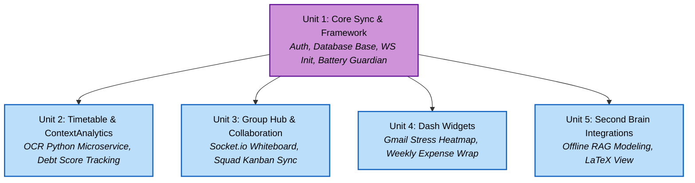

# Unit Dependency Matrix

The Hybrid strategy permits thin-foundation development where Unit 1 serves as the crucial bottleneck, but Units 2 through 5 can scale vertically with UI + Backend built synchronously without blocking each other.

| Target Unit | Blocked By | Dependency Justification |
| --- | --- | --- |
| **Unit 2 (Timetable/Analytics)** | Unit 1 | Needs the WatermelonDB models generated in U1 to store calculated attendance metrics and Cognitive Debt scores locally. |
| **Unit 3 (Discussion/Kanban)** | Unit 1 | Depends on the core WebSocket (Socket.io) context architecture initialized in Unit 1 to transmit whiteboard states. |
| **Unit 4 (Widgets: Heatmap/Expense)**| Unit 1 | Requires the base dashboard UI to be rendered; entirely decoupled from Unit 2/3. |
| **Unit 5 (Second Brain RAG)** | Unit 1 | Needs the Smart Battery Guardian flags (from U1) to legally pause TensorFlow indexing logic dynamically. |

## Flow diagram showing parallelization execution topology

