# Execution Plan

## Detailed Analysis Summary

### Change Impact Assessment
- **User-facing changes**: Yes - A completely new mobile application UI/UX optimized for students tracking high academic workloads.
- **Structural changes**: Yes - Hybrid architecture utilizing local-first storage (SQLite) and local ML executing on-device, syncing via WebSockets to Node.js/Python cloud microservices.
- **Data model changes**: Yes - Deep data modeling for Timetables, Attendance tracking, Kanban states, and offline queued events.
- **API changes**: Yes - New REST and WebSocket schemas establishing the connection between Mobile App and Backend frameworks.
- **NFR impact**: Yes - Offline-first robust queuing, low-battery guardian functionality, and strictly local privacy guarantees for RAG execution are architecturally pivotal non-functional requirements.

### Risk Assessment
- **Risk Level**: High - Advanced local ML implementation (TF.js or equivalent) via React Native / Native combined with robust concurrent offline event syncing logic is technically complex.
- **Rollback Complexity**: Minimal (Greenfield).
- **Testing Complexity**: Complex - Needs robust emulation simulation for transitioning between offline/online environments perfectly and resolving conflict state matrices.

## Workflow Visualization

```mermaid
flowchart TD
    Start(["User Request"])
    
    subgraph DISCOVER["🔵 DISCOVER PHASE"]
        WD["Workspace Detection<br/><b>COMPLETED</b>"]
        RE["Reverse Engineering<br/><b>SKIP</b>"]
        RA["Requirements Analysis<br/><b>COMPLETED</b>"]
        WP["Workflow Planning<br/><b>COMPLETED</b>"]
        US["User Stories<br/><b>EXECUTE</b>"]
        AD["Application Design<br/><b>EXECUTE</b>"]
        UP["Units Generation<br/><b>EXECUTE</b>"]
    end
    
    subgraph BUILD["🟢 BUILD PHASE"]
        FD["Functional Design<br/><b>EXECUTE</b>"]
        NFRA["NFR Requirements<br/><b>EXECUTE</b>"]
        NFRD["NFR Design<br/><b>EXECUTE</b>"]
        ID["Infrastructure Design<br/><b>EXECUTE</b>"]
        CG["Code Generation<br/><b>EXECUTE</b>"]
        BT["Build and Test<br/><b>EXECUTE</b>"]
    end
    
    subgraph DEPLOY["🟡 DEPLOY PHASE"]
        OPS["Deploy<br/><b>PLACEHOLDER</b>"]
    end
    
    Start --> WD
    WD --> RE
    RE --> RA
    RA --> WP
    WP --> US
    US --> AD
    AD --> UP
    UP --> FD
    FD --> NFRA
    NFRA --> NFRD
    NFRD --> ID
    ID --> CG
    CG --> BT
    BT --> OPS
    OPS --> End(["Complete"])
    
    style WD fill:#4CAF50,stroke:#1B5E20,stroke-width:3px,color:#fff
    style RA fill:#4CAF50,stroke:#1B5E20,stroke-width:3px,color:#fff
    style WP fill:#4CAF50,stroke:#1B5E20,stroke-width:3px,color:#fff

    style RE fill:#BDBDBD,stroke:#424242,stroke-width:2px,stroke-dasharray: 5 5,color:#000
    style OPS fill:#BDBDBD,stroke:#424242,stroke-width:2px,stroke-dasharray: 5 5,color:#000

    style US fill:#FFA726,stroke:#E65100,stroke-width:3px,stroke-dasharray: 5 5,color:#000
    style AD fill:#FFA726,stroke:#E65100,stroke-width:3px,stroke-dasharray: 5 5,color:#000
    style UP fill:#FFA726,stroke:#E65100,stroke-width:3px,stroke-dasharray: 5 5,color:#000
    style FD fill:#FFA726,stroke:#E65100,stroke-width:3px,stroke-dasharray: 5 5,color:#000
    style NFRA fill:#FFA726,stroke:#E65100,stroke-width:3px,stroke-dasharray: 5 5,color:#000
    style NFRD fill:#FFA726,stroke:#E65100,stroke-width:3px,stroke-dasharray: 5 5,color:#000
    style ID fill:#FFA726,stroke:#E65100,stroke-width:3px,stroke-dasharray: 5 5,color:#000
    style CG fill:#FFA726,stroke:#E65100,stroke-width:3px,stroke-dasharray: 5 5,color:#000
    style BT fill:#FFA726,stroke:#E65100,stroke-width:3px,stroke-dasharray: 5 5,color:#000

    style DISCOVER fill:#BBDEFB,stroke:#1565C0,stroke-width:3px, color:#000
    style BUILD fill:#C8E6C9,stroke:#2E7D32,stroke-width:3px, color:#000
    style DEPLOY fill:#FFF59D,stroke:#F57F17,stroke-width:3px, color:#000
    style Start fill:#CE93D8,stroke:#6A1B9A,stroke-width:3px,color:#000
    style End fill:#CE93D8,stroke:#6A1B9A,stroke-width:3px,color:#000
    
    linkStyle default stroke:#333,stroke-width:2px
```

## Phases to Execute

### 🔵 DISCOVER PHASE
- [x] Workspace Detection (COMPLETED)
- [x] Reverse Engineering (SKIPPED)
- [x] Requirements Analysis (COMPLETED)
- [x] Execution Plan (COMPLETED)
- [x] User Stories - [EXECUTE]
  - **Rationale**: Highly contextual, multi-persona mobile application requiring defining explicit interaction scenarios.
- [x] Application Design - [EXECUTE]
  - **Rationale**: Needs explicit definition of components mapping across Mobile -> Node.js -> Python APIs.
- [x] Units Generation - [EXECUTE]
  - **Rationale**: The project is large enough to warrant decomposition into multi-module units (e.g., Mobile UI unit, API/WebSocket services unit, ML algorithms unit).

### 🟢 BUILD PHASE
- [ ] Functional Design - [EXECUTE]
  - **Rationale**: Offline sync resolution logic, attendance calculation algorithms, and ContextSwitch cognitive decay equations must be mathematically and functionally verified first.
- [ ] NFR Requirements - [EXECUTE]
  - **Rationale**: Essential for battery life thresholds, offline latency limits, and verifying on-device NLP processing compute thresholds.
- [ ] NFR Design - [EXECUTE]
  - **Rationale**: Designing structured strategies for message queue management and total RAG privacy isolation compliance.
- [ ] Infrastructure Design - [EXECUTE]
  - **Rationale**: Identifying clear cloud deployment mapping for Node.js websocket real-time routing and Python microservice hosting.
- [ ] Code Generation - EXECUTE (ALWAYS)
  - **Rationale**: The actual code programming for mobile frontend and web backend services.
- [ ] Build and Test - EXECUTE (ALWAYS)
  - **Rationale**: Verification of system integrity across varied offline-to-online network stability tests.

### 🟡 DEPLOY PHASE
- [ ] Deploy - PLACEHOLDER
  - **Rationale**: Future deployment orchestration module.

## Success Criteria
- **Primary Goal**: Provide a rigorous blueprint resulting in a high-fidelity fully autonomous Lumina mobile application instance.
- **Key Deliverables**: Offline vector embeddings locally processed, fully functional frontend models communicating to queued datastores.
