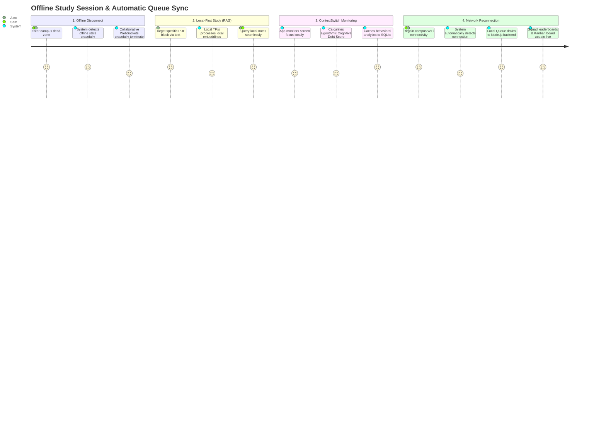

# Core User Journey: Offline Deep Focus to Online Squad Sync

This Mermaid visualization depicts the critical flow of a student transitioning between offline deep study and online collaboration synchronization. It outlines the specific user paths for both Sam and Alex working seamlessly despite connectivity drops.

